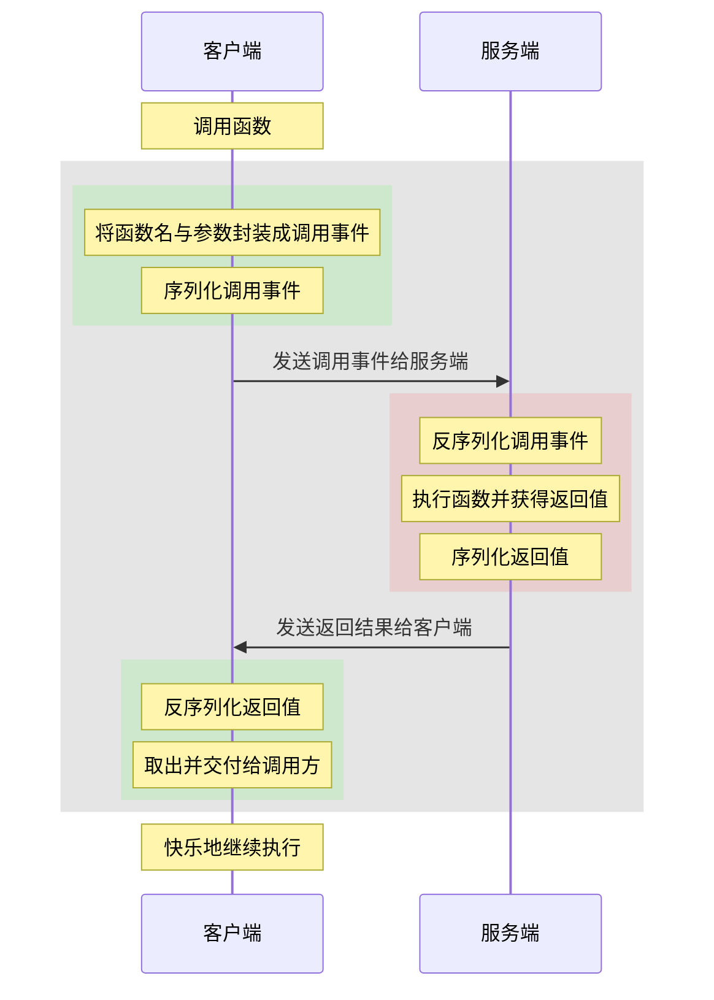

---
title: 基于python实现rpc
date: 2020-08-30 14:41:26
tags: 
---

[原文链接](https://blog.csdn.net/wz2671/article/details/108269400)
<!--more -->


# 基于python实现RPC的demo
<font color=#999AAA > 这是一个远程过程调用（RPC）的实现demo，可以实现不同的python进程之间通信和互相调用函数，简单易用，易于扩展。更多功能也可进一步完善，本文介绍了该实现的主要思路。


<hr style=" border:solid; width:100px; height:1px;" color=#000000 size=1">

# 前言

<font color=#999AAA >计划手撸一个rpc甚久了，在间歇性push自己下终于完成的差不多了。写这个demo的原因，1）是为了学习与思考下这部分主体功能和实现思路，2）是调包时可以毫无心理负担，并产生一种不过如此的优越感。
实现这部分内容主要依据的还是自己的想法，因此可能会有bug或者有更好的实现方式，仅供学习和参考，完整代码可参考[Gitee链接](https://gitee.com/yunl2435/RPC-DEMO)。
实现的时候用的是`python2.7`，忘记换了，下次一定更新。
</font>

<hr style=" border:solid; width:100px; height:1px;" color=#000000 size=1">

# 一、主要内容
所谓RPC，是远程过程调用（Remote Procedure Call）的简写，网上解释很多，简单来说，就是在当前进程调用其他进程的函数时，体验就像是调用本地写的函数一般。
本文实现的是在本地调用远端的类`class`对象的接口，也就是本地的`client`不实例化类对象，调用的是`server`端的类对象接口。
为了达到让调用层无须关心底层实现，拥有丝滑般的体验，就需要以下几个部分：
1. **客户端**需要把类的接口提取出来，并将调用函数事件捕获存储起来；**服务端**需要把类的公有函数作为可远程调用的接口。
2. **客户端**把调用函数的事件（调用的函数，参数）进行序列化并发送给服务端；**服务端**将客户端的调用事件反序列化，并执行相应的接口，将返回值发送给客户端。
3. **客户端**与**服务端**通过某种方式（一般就是网络socket）进行通信。

<font color=#999AAA >在下面时序图的灰色部分，对于调用方来说是透明的，它的执行结果应该和执行本地的函数时一致的。



***
# 二、实现步骤
## 1. 进程间的通信
本文采用了基于`TCP`的`sokcet`连接来进行进程之间的通信，更多实现细节可参考之前[博客](https://blog.csdn.net/wz2671/article/details/107448828)。
在此**需要注意：**
* 本文采用了`select`模块来监听网络事件，如果服务端未收到任何的网络消息会一直阻塞在这儿。如果服务端除了提供rpc调用服务之外还需要执行其他逻辑，那么应当采用非阻塞，轮询`socket`的方式来判断是否有新的网络事件。
	```python
	# ServerBase.py
	def process(self):
	    readable, writable, exceptional = select.select(self.inputs, self.outputs, self.conns.values())
	    for conn in readable:
	        if conn is self.socket:
	            self._handle_conn()
	        else:
	            self._handle_recv(conn)
	    for conn in writable:
	        pass
	    for conn in exceptional:
	        self._handle_leave(conn)
	```
	
* 客户端的网络事件本文通过创建新的线程来监听的。并不会影响客户端主线程的执行，因此可以尽情的阻塞。部分代码如下：
	```python
	# AsynCallback.py
	class AsyncTaskManager(object):
	    _asy_events = dict()
	
	    def __init__(self, loop, *args):
	        super(AsyncTaskManager, self).__init__()
	        self._loop_fun = loop
	
	    def __call__(self, *args, **kwargs):
	        proc = threading.Thread(target=self._exec_loop, args=args, kwargs=kwargs)
	        proc.start()
	
	    def _exec_loop(self, *args, **kwargs):
	        while True:
	            net_resp = self._loop_fun(*args, **kwargs)
	            for resp in net_resp:
	                asy_event = self._asy_events.pop(resp.rid)
	                asy_event.set()
	            
	```
	```python
	# Client.py
	class Client(TaskHandle, ClientBase):
	
		@AsyncTaskManager
		def process(self):
		    super(Client, self).process()
		    _events = []
		    while self.has_events:
		        event = self.get_next_event()
		        data = event[1]
		        _events.append(self.unpack_respond(data))
		    return _events
	```
* 序列化方式，本文采用了库`pickle`进行序列化与反序列化，使用它的原因是可以将自定义类对象也进行序列化，非常之高级。

***

## 2. 异步回调实现思路
* 对于需要返回值的函数调用，处理起来比较简单，只需要将主线程阻塞等待，直至超时或者接收到了对应函数的返回值即可。本文采用了`threading.Event`来阻塞与唤醒调用的函数，同时采用了装饰器来实现这功能。若日后有更好的方法，可以轻易进行替换。相关示例代码如下所示：
	```python
	@AsyncTaskManager.respond
	def _handle_response(self, tid):
	    """ 处理有返回值的情况
	    会阻塞线程直至收到返回值
	    """
	    task = self.pop_task(tid)
	    if task.callback:
	        task.callback()
	    return self.pop_respond(tid)
	
	@staticmethod
	def respond(func):
	    @wraps(func)
	    def make_resp(handle, tid):
	        """ 需要注意的是，和装饰的函数参数含义需一致 """
	        event = threading.Event()
	        AsyncTaskManager._asy_events[tid] = event
	        event.wait(timeout=TIME_OUT)
	        return func(handle, tid)	# 这儿才是真正执行_handle_response的地方
	    return make_resp
	```

* 在实际的应用过程中，应有这样的情况，服务端与客户端都是独立的应用，通过rpc函数进行通信和交互，而并不是某方为另外一方提供服务，那么此时返回值并不必要，只需要将要做的事通知另一方即可。对于此种情况，可以采用异步回调的方式来告知调用方对应函数执行成功了。
  在文中依旧采用线程来完成该功能，客户端调用函数之后创建一个新线程并阻塞住，等待服务端将执行结果发回后再唤醒，如果有回调函数就执行。示例代码如下：
	```python
	@AsyncTaskManager.callback
	def _handle_call_back(self, tid):
	    """ 处理有回调函数的调用
	    callback会等tid事件调用成功之后 才会回调，且不会有返回值
	    """
	    task = self.pop_task(tid)
	    if task.callback:
	        task.callback()
	        
	@staticmethod
	def callback(func):
	    @wraps(func)
	    def make_thread(event, *args, **kwargs):
	        event.wait(timeout=TIME_OUT)
	        func(*args, **kwargs)
	
	    def make_async(handle, tid):
	        """ 注意点同上 """
	        event = threading.Event()
	        AsyncTaskManager._asy_events[tid] = event
	        _task = threading.Thread(target=lambda: make_thread(event, handle, tid))
	
	    return make_async
	```

***

# 总结
<font color=#999AAA >总的来看，实现起来还是蛮简单的。

