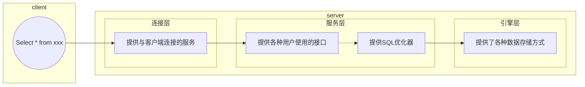
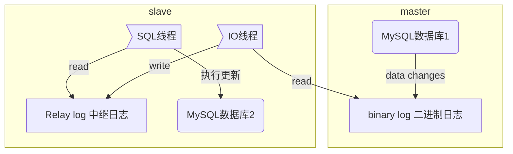

准备把数据库相关的知识好好补下，这样可以在面试的时候carry全场，一点不虚，参考内容如下：

《高性能MySQL》  
[博客](https://www.cnblogs.com/sharpest/p/10390035.html)  
[视频教程](https://b23.tv/av29072634/p1)  


<!-- more -->

# 基础知识
插入语句：$

# MySQL优化技巧
参考《高性能MySQL》，[博客](https://www.cnblogs.com/sharpest/p/10390035.html)，[视频教程](https://b23.tv/av29072634/p1)

***

### 1. 总览：
* 设计： 存储引擎，字段类型，范式与逆范式
* 功能：索引，缓存，分区分表
* 架构：主从复制，读写分离，负载均衡
* 合理SQL：测试，经验

***
### 2. 存储引擎
* MySQL逻辑分层


* ```create table tablename() engine = myisam | innodb ;``` 
  存储引擎是myisam或innodb。读写锁，行级锁，表级锁。
    * **InnoDB存储引擎**（事务优先）：MySQL v>=5.5，推荐使用innodb。支持事务，行级锁定，外键约束。事务安全型存储引擎，更加注重数据完整性和安全性。（擅长事务、数据的完整性及高并发处理，不擅长快速插入“要排序”和检索）例如用在*财务管理系统*。
    * **MyISAM存储引擎**（性能优先）：（Indexed Sequential Access Method 索引顺序存取方法）擅长于处理，高速读与写。（数据和索引存在不同的文件中，存储顺序为插入顺序，支持数据压缩，支持表级锁定，不支持高并发访问，支持并发插入）例如用在*微博项目系统*。

***
### 3. 字段类型选择
尽可能小（占用存储空间少），尽可能定长（占用存储空间固定），尽可能使用整数。常用类型：（整数，浮点型，定点型`DECIMAL`，日期，字符，属性）

***
### 4. 范式与逆范式
* 第一范式（每列具有原子性）第二范式（每列都和主键相关）第三范式（每列都和主键列直接相关而不是间接相关）
* 逆范式，通过增加冗余或重复的数据来提高数据库的性能。

***
### 5. **索引**
* 优化的原因：性能低，执行时间长，等待时间长，SQL语句欠佳，索引失效，服务器参数设置不合理（缓冲区，线程数）。
* $\color{red}{编写过程：}$ `select ... from ... join ... on ... where ... group by ... having ... order by ... limit ...`
  $\color{red}{解析过程：}$ `from ... on ... join ... where ... group by ... having ... select ... order by ... limit ...`
[MySQL架构](https://www.cnblogs.com/annsshadow/p/5037667.html) SQL 优化主要从索引进行优化。
* $\color{blue}{索引}$是帮助Mysql高效获取数据的*排好序*的*数据结构*，其底层实现一般为$\color{red}{B+树}$，经常会和红黑树，B树，hash表进行对比，至于优劣红黑树的高度无法控制，I/O次数过多，B树存储数据的密度不高，hash表无法进行范围查找。
* **B+Tree**：非叶子节点不存储数据，只存储索引，在16k默认的节点大小下，可以存放更多的索引，叶子节点不存储指针，增加了顺序访问指针（方便范围查找）。 千万级别的数据只需要两次磁盘I/O就可以找到对应元素。
* MySQL存储引擎，*MyISAM*使用的是非聚集索引，索引文件和数据文件是分开存放的，在B+树的叶子节点中，数据存储的是**文件指针**；*InnoDB*使用的是聚集索引，叶子节点包含了完整的数据，一般要求自增索引，这样可以在插入数据时有效避免节点分裂，提高效率。
* 优缺点：缺，1. 索引本身占用内存（一个节点16k）。2. 不是所有的情况均适用（数据量较少，频繁更新，很少实用的字段）。3. 降低增删改的效率。优：1. 提高查询效率（降低I/O次数）。2. 降低CPU使用率（例如排序）。
* 索引分类：单值索引；唯一索引；复合索引（相当于二级目录）
* 创建索引：  
```sql
    create 索引类型 索引名 on 表（字段）;
    create  index dept_index on tb(dept);
    create unique index dept_index_dn on tb(dept, name);
    drop index 索引名 on 表名;   # 删除索引 
```
* 可以用`explain`命令查看执行路径。  
    在三表联合查询时，表的执行顺序会随记录的数量改变而改变，因为编译器会根据自动进行优化（改变笛卡尔积运算的次序）。  
    id值不同的越大越先执行，id值相同的数据量小的表优先查询。
    在嵌套子查询时，先查内层再查外层。
* 索引类型
    * select_type：
        * PRIMARY（主查询）
        * SIMPLE（简单查询，不包含子查询，union）
        * SUBQUERY（子查询）
        * DERIVED（有临时表from(子表或union表)）
    * type：`system>const>eq_ref>ref>range>index>all`
    * possible_keys：可能用到的索引；key：实际用到的索引；key_len：索引的长度；
    * extra：
        * using filesort：性能消耗大，需要额外的一次排序
        * using temporary：用到了临时表（一般出现在group by）
        * using index：性能提升；索引覆盖（$\color{red}{好}$，不需要回原表查询）
        * using where：必须回表查询
* 优化：查询时索引覆盖->`where`和`order by`拼起来不要跨列。
    * 单表优化：
        * 索引不能跨列使用，遵循最佳左前缀，保持索引的定义和使用顺序一致
        * 索引需要逐步优化，不是一步登天
        * 将含`in`的范围查询放置最后
     * 两表优化：`where`小表.X=大表.Y（小表驱动大表）；一般情况对于左外连接，给左表加索引，右外连接给右表加索引。
     * 多表优化：小表驱动大表，索引建立在经常查询的字段上。
* $\color{red}{索引失效}$
    * 复合索引，不要跨列或无序使用（顺序一致性），尽量使用全索引匹配
    * 不要在索引上进行任何操作（计算，函数，类型转换），否则索引失效
    * 复合索引不能使用不等于`!=; <>`，`is null`，`not null`
    * $\color{red}{尽量使用索引覆盖}$
    * `like`尽量以"常量"开头，不要以"%"开头，否则索引失效
    * 尽量不要使用类型转换（显式，隐式），否则索引失效
    * 尽量不要使用`or`，否则索引失效
* 其他优化策略
    * `exist`和`in`: `select ... from table where [exist | xxx in] (子查询)`
        * 如果主查询的数据集大，则使用`in`
        * 如果子查询的数据集大，则使用`exist`
    * order by 优化: using filesort 分为单路排序和双路排序。
        * 选择使用单路，双路排序，调整buffer的容量大小。
        * 避免`select * from xxx`
        * 复合索引不要跨列使用
        * 全部排序字段的排序一致性。
 * SQL慢查询排查——慢查询日志：MySQL中记录超过阈值（在开发调优时打开）
    查询超过阈值的SQL：`show global status like '%slow_queries%';`，也可以`cat`对应的文件，使用`mysqldumpslow`工具查看
* 分析语句的执行时间
    * 粗略：`show profiles;`
    * 精确：`show profile all for query id;`
    * 全局查询日志：记录了全部的SQL语句。

***
### 6. 锁机制
* 解决因资源共享而造成的并发问题，（高并发问题包括：脏读，幻读，不可重复读，丢失更新等问题）
* 锁的分类：操作类型（读锁，写锁）操作范围（行锁，表锁，页锁）
    * *表锁*：MyISAM存储使用表锁，开销小，加锁快；无死锁，但锁的并发程度低，冲突次数多。
    * *行锁*：InnoDB存储引擎使用航锁，开销大，加锁慢，容易出现死锁，但是并发度高。
* 查看加锁的表：`show open tables;`
* 会话：`session`，每一个访问数据的命令行，客户端工具都可以称为一个会话。
* 表锁
    * 读锁
        ```sql
            lock table tablelock read;
            select * from tablellock;                   --读，可以
            delete from tablelock where id=1;   --写，不可以
            unlock tables;      -- 也可以通过事务解锁
        ```
        某个会话如果对A表加了读锁，那么这个会话只能对A进行读操作，不能写A以及对其他表进行操作。
        其他会话可以对A表进行读操作，但是写操作回一直等待上述会话释放锁，其他表不受影响。
    * 写锁
        `lock table tablelock write;`
        当前会话可以对加了写锁的表进行任何操作（增删改查），但是不能对其他表进行操作。其他会话对加锁的表操作需要锁被释放。MyISAM会根据操作自动加锁。
* 行锁
    * 一次锁一行数据，如果操作的是不同数据，则互不干扰。
    * 如果没有索引，则行锁会转为表锁。'
    * 在where的一段范围中，如果有间隙，会自动给间隙数据加锁（间隙锁）
    * 可以通过事务解锁（commit）
    * 优缺点：优，并发能力强，效率高；缺，性能损耗大
    * 行锁分析 `show status like '%innodb_row_lock%';`
        * Innodb_row_lock_current_waits: 当前正在等待锁的数量
        * Innodb_row_lock_time: 等待总时长
        * time_avg; time_max; waits
    * 可以通过`for_update`对`queue`语句加锁。

### 7. 主从复制
主从复制就是指MySQL数据从一个主节点复制到多从节点上。

* 步骤
    * master服务器将`sql`操作记录在本地的`binary log`中（二进制日志事件）
    * slave将master的`binary log`拷贝到自己的`relay log`中
    * 执行`relay log`中的行为，将数据读取到自己的数据库中（中继日志事件）
* 主从复制
    * 异步的，有延迟的，串行化的
    * 每次在做主从同步前，需要观察主机状态的最新值。`show master status;`