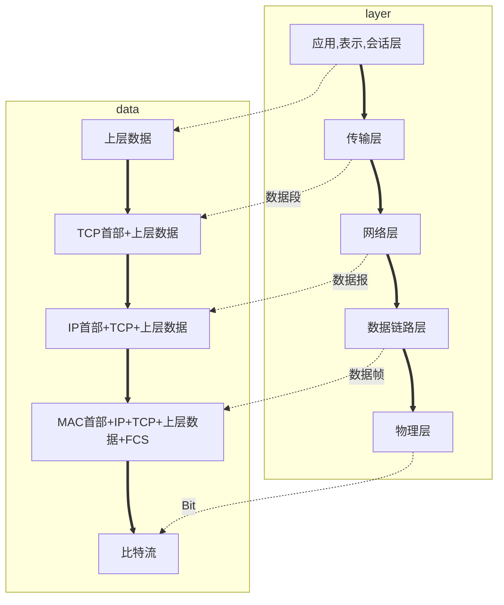

<!--toc -->
* C/C++
* 操作系统
* 计算机网络
* 数据库
* 设计模式

<!--more -->


# 一、C/C++笔记

参考《C和C++程序员面试秘籍》、牛客网、《C++沉思录》、《More Effective C++》

## 1.1 C
1. 宏定义
    加括号，不加分号
2. 预定义
3. 智能指针
主要是针对内存泄漏问题，利用生命周期结束时，类会自动调用析构函数，让智能指针类自动释放内存。
常用的有shared_ptr, unique_ptr, weak_ptr, auto_ptr。
unique_ptr独占指针，不能赋值，不能和其他指针指向同一对象，可以使用move函数移交权限。
shared_ptr可以多个智能指向同一个对象，会对引用个数进行技术，当计数为0时会自动释放内存，但可能出现循环引用的情况。
weak_ptr针对循环引用问题，不管理内存，不改变计数，访问对象时需要转换成shared_ptr。
auto_ptr赋值不报错，会崩溃。

4. 引用和指针
引用必须被初始化为一个已有对象，它是变量的一个别名，和原始的变量指的同一块内存区域，应避免函数返回引用，无论是否是new的内存。流操作符应返回引用或指针。
指针本身就是一个变量，存储着内存区域的地址。
引用不可以指向空，指针可以为空。引用效率更高，不用测试其有效性。
指针可以被重新赋值，引用总是代表原始对象。对指针赋值不会改变原始值。
**引用使用**: 当指向某个东西并且不会再改变时，当实现一个操作符且语法需求无法用指针满足。

5. cast类型转换
常用的有四种，static_cast, dynamic_cast, const_cast, reinterpret_cast.
static_cast用的较多，可以转换各种类型，继承中向下转换不安全。（和C旧式转型有相同的威力和意义）
dynamic_cast动态转换，适用于含有虚函数的转换，用于类层次的转换.(将指向基类的指针或引用转换为指向子类的对象的)
const_cast 改变的是某事物的常量性或变易性(volatileness)。

6. allocator类
可以在不调用构造函数的情况下，预先申请内存块，只需要指定类型和对象个数即可。allocate(deallocate), construct(destroy)。
释放内存前要先调用destroy.可以根据自己的需求，自由构建对象。
内存分配分为两种，对应的系统调用为brk和mmap。

7. 模板类

8. 结构体: 默认的继承方式是公有（而class默认的继承方式是私有）

9. 内存对齐：
 * 规则1：第一个成员从0开始，以后每个数据成员的偏移量必须是min(#pragma pack(), 这个数据成员的自身长度)的倍数。
 * 规则2：数据内成员对齐完毕后，结构体本身也要对齐，按照min(#pragma pack(), 最大数据成员长度)对齐。


## 1.2 C++

### 1.2.1 面向对象
* struct 与 class的区别
    c语言中struct是没有成员函数的。c++中struct中默认都是公有的（公有继承，公有成员变量等）。
	
* 使用不带参数的构造函数构造对象时，不用加括号。

* 初始化列表的初始化顺序与变量声明的顺序一致。

* 初始化列表必用：const和reference类型成员变量，父类的private成员变量。

* 普通构造函数能够被隐式调用，而explicit构造函数只能被显示调用。

* 基类的析构函数应为virtual。
	不然可能会产生内存泄漏。（当父类指针指向子类对象时，不含虚指针会是指针调用父类的析构函数，无法释放子类空间）

	* 复制构造函数要深拷贝，形式为`Test(const Test &test){}`,会在三种情况调用：1.`void fun(Test test){}`；2.`Test fun(){return Test t}`；3.`Test t2 = t1`。

* 复制构造函数和赋值函数(`Test & operator = (const Test &test)`)的区别: 复制构造函数会创建新对象新内存。赋值函数是引用对象。赋值函数要释放内存，检查是否同一对象。

* `String`类的编程实现（运算符重载）。

* 多态和指针运算（对象数组）不应当混用，不同指针指向的size不一样。


### 1.2.2 继承和多态
* 私有继承：编译器不会将派生类对象转换成基类对象。建议用组合，不用私有继承。

* 虚继承：可以有效避免多重继承的二义性，只会调用一次父类的构造函数。

* 虚函数实现：
如果一个类含有虚函数，操作系统会为这个类分配一个指针成员指向一个虚函数表（VTBL），每一项指向一个虚函数的地址（函数指针的数组）。
每个类有自己的虚函数表，子类会覆盖父类的虚函数表项，虚函数表里内容是函数指针，指向代码段中函数的地址，每个对象有指向虚函数表的指针，它会动态地决定具体指向哪个虚函数表。

* 在编译期间无法确定指针指向的是基类对象还是派生类对象，但编译后的调用代码能够根据具体对象获取正确的VTBL，调用正确的虚函数。

### 1.2.3 内存
* malloc原理：
分为两种情况，*一种*是分配的内存小于128K，直接在堆区中进行分配，对应的系统调用是brk。
堆区也只有在初次调用malloc函数时，操作系统才会进行分配。一般是从低地址位向高地址位增长。
其中堆区内存是由大小不一的内存块通过隐式链表链接的，结构体mm_struct中记录着内存块的结束和开始位置。
分配时通过遍历空闲内存块获取最合适的内存块进行分配。
*另一种*是在分配的内存大于128K时，这时候会在文件映射区进行分配。对应的系统调用是mmap。
它在内存中的位置一般间于堆区和栈区，该区会建立一个磁盘到内存映射，这也是虚拟内存的一种实现方式。
除此之外文件映射区中一般还存储着动态链接库。

* C++内存块分为6个部分
数据段，代码段，BSS段，堆区，栈区，文件映射区。
数据段，存储着静态变量和全局变量。
代码段，存储着二进制机器码
BSS，存储着未初始化或者值为零的全局变量或静态变量。
栈区，存储着局部变量，函数参数，返回地址，返回值等。

* 内存泄漏
C++在对象被产生时，会自动调用构造函数，构造函数本身也会配有资源(有成员也是对象，对象有自己的资源)。


## 1.3 C++多线程编程
[参考视频](https://b23.tv/av48611530/p5)

### 1.3.1 看的博客
1. 并发执行带来的问题，死锁—是因为多个线程竞争资源而造成的僵局，进程无法向前推进。
2. 死锁产生的原因：系统资源的竞争，进程推进顺序非法，（信号量使用不当也会造成死锁，等待对方的资源）
3. 死锁产出的必要条件：互斥条件，不可剥夺条件，请求和保持条件，循环等待条件。
4. 避免死锁：加锁顺序；加锁时限；死锁检测。
5. 加锁顺序：指保证线程都是按照相同的顺序获得锁，那么死锁就不会发生。
6. 加锁时限：为尝试获取锁的时候加一个超时时间，如果超时就放弃对该锁的请求，并回退释放所有已经获得的锁，等待一段随机时间后再重试。（避免在同一时间出现很多竞争，当线程很多时，可能会同时竞争，同时超时。）
7. 死锁检测：当一个线程获得了锁，在线程或者锁相关的数据结构中将其记下，每当有线程请求锁，也需要记录在这个数据结构中。检测出来之后，就是释放所有的锁，回退等待一段时间后再重试，也可以设置优先级，优先级低的线程释放锁资源，优先级高的继续请求。

### 1.3.2 C++锁  
[参考博客](https://www.jianshu.com/p/8c0ca5ba2338)
1. 互斥锁： 指的是保证线程互斥访问一个信号量，避免多个线程同时访问同一内容而产生错乱。
2. 条件锁：条件锁
3. 自旋锁
4. 读写锁
5. 递归锁


### 1.3.3 线程创建与启动
竞争资源可使用互斥量`mutex`，在头文件`include<mutex>`中，还有`std::mutex`来定义锁对象。

### 1.3.4 在C++11新标准库（可移植性）
* 线程启动、结束，创建线程步骤：
    * 包含头文件<thread>
    * 创建初始函数
    * `main`函数中创建线程并开始执行
        ```c++
        thread mytobj(myprint);
        mytobj.join();
        ```

***

# 二、操作系统
1. 进程调度，进程通信，内存管理，设备管理，文件管理，网络通信，作业控制。  
2. 系统调用--操作系统实现特定功能的过程，为程序提供访问操作系统的接口。（访管指令，异常中断指令）

## 2.1 中断
1. 中断--暂时中止CPU上运行的程序，转去执行相应的事件处理程序（操作系统是中断驱动的）。
    I/O ，外围设备，系统调用。
2. 异常，当前运行的指令引起的中断事件。
    处理器：算术异常、非法存取、终止进程。
    内存储器，总线等硬件故障。
3. 中断屏蔽--决定是否相应中断。
4. 中断优先级，中断嵌套处理。

## 2.2 进程
1. **进程**--操作系统为管计算机系统中运行的程序所建立的一个管理实体，是具有独立功能的程序关于数据的运行活动，是操作系统进行资源调度和分配的一个独立单位。
2. **进程**包括五个部分：os部分--**管理运行程序的数据结构**P，控制程序执行的**程序状态字信息**PSW。程序部分--**内存代码**C，内存数据D，通用寄存器信息R。
3. **进程状态**：运行态，就绪态，等待态。
    挂起：资源不足（性能低，死锁）->资源被剥夺。
4. **进程控制块**（Process Control Block）--用于记录和刻画进程状态及环境信息的数据结构。
    **标识信息**：进程标识（系统：系统标识号，进程组标识号；用户：进程名，进程组名）
    **现场信息**：进程运行时处理器现场信息：用户可见寄存器（数据，地址），控制与状态寄存器（PC、IR、PSW），栈指针。
    **控制信息**：存放与管理、调度进程相关的信息。
5. **模式切换**（处理器状态切换）
    * 进程切换必须在内核模式下完成
    * 用户模式->内核模式（中断，系统调用，异常）；内核模式->用户模式（os执行中断返回指令）
6. 进程控制与管理
    * 进程创建：进程表加一项，申请PCB并初始化，生成标识，建立映像，分配资源，移入就绪队列。
    * 进程撤销：和创建相反
    * 进程阻塞：保存现场信息，修改PCB，移入等待队列
    * 进程唤醒
    * 进程挂起：修改状态，移入相关队列，收回内存等资源，送至对换区
    * 进程激活
7. 进程管理软件
    * 系统调用/中断/异常处理程序
    * 队列管理模块
    * 进程控制/调度/通信程序
    * 外围程序（终端登陆，作业控制，性能监控）
8. 进程上下文--用户级（用户程序块，用户数据区，用户栈，用户共享内存）；寄存器（PSW，栈指针，通用寄存器）；系统级（PCB，内存区表，核心栈）
9. 线程
    * 进程切换开销大；通信开销大；并发粒度低；并行计算效率低
    * "独立分配资源"与"调度分派执行"，进程是系统资源分配的独立单位，不需要频繁地切换。
    * 线程是系统调度和分派的基本单位，能轻装运行，会被频繁地调度和切换，并发粒度更细，并发性更好。

## 2.3 处理器
1. 调度的层次
    * 高级调度（长程调度，作业调度）：决定能否加入到执行的进程池中。
    * 中级调度（平衡负载调度）：决定主存中的可用进程集合。
    * 低级调度（短程调度，进程调度，处理器调度）：决定哪个可用进程占用处理器执行。
2. 调度算法
    * 时间片轮转调度算法
    * 分级调度算法（不同优先级）
    * 彩票调度算法（类似令牌）
3. [抢占时任务调度与非抢占式的区别](https://blog.csdn.net/u013176681/article/details/39256191)（什么时候我也能这么能吹）

## 2.4 存储管理

## 2.5 文件系统

## 2.6 并发程序设计
1. 特性：
    * 并发性：多个进程并行执行，提高了计算效率。
    * 共享性：多个进程共享软件资源。
    * 交往性：制约，有难度。
2. 互斥与同步
    * 互斥：相互争夺独占性资源
    * 同步：为完成共同任务 协调执行先后关系
3. 信号量
    * 记录型信号量
    ```c++  
    typedef struct semaphore
    {
        int vales;  //信号量值
        struct pcb *list; //信号量等待进程队列指针
    }
    
    ```
    * P、V操作原语
    ```c++
    procedure P(semaphore:s)
    {
        s -= 1;     //信号量-1
        if (s<0) W(s);//若信号量小于0，则调用进程被置成等待信号量s的状态
    }
    
    procedure V(semaphore:s)
    {
        s += 1;     //信号量+1
        if (s<=0) R(s); //// 若信号量小于等于0，则释放一个等待信号量s的进程
    }
    ```
4. 管程
    把分散在各个进程中互斥地访问公共变量地临界区集中起来管理，它局部变量只能由该管程的过程存取。
    管程的条件变量：
    * 条件变量(condition variables):当调用管程过程的进程无法运行时，用于阻塞进程的信号量。
    * 同步原语wait：没有资源->阻塞进程
    * 同步原语signal:释放条件变量上阻塞的进程
5. 进程通信
    
## 2.7 面试常问

1. 进程线程
* 进程通信方式有：共享内存，信号，信号量，消息队列，套接字，管道
* 线程通信方式：信号量，互斥量，信号，条件变量等

* 消息队列：异步，解耦，消峰

* 共享内存：
创建一个逻辑内存可以让不同的进程去访问同一个逻辑内存，sys/shm.h
1). 创建共享内存。2). 连接共享内存到当前进程的地址空间。3). 分离共享内存。4). 控制共享内存。

* *同步与互斥*: 互斥锁，信号量，自旋锁，读写锁，条件变量

* *死锁条件*： 互斥访问，环路等待，请求和保持，不可剥夺

2. I/O优化的方式：
* 所谓I/O,就是从内核中获取数据的过程（例如从磁盘中载入数据到内存）
    分为阻塞和非阻塞两种，阻塞指调用者一直再等待事件的发生，而非阻塞会去做其他事情。
    主要的历程：采用多线程=>采用线程池=>采用非阻塞接口=>采用多路复用I/O=>异步I/O。

* *线程池*
    设置生产者消费者队列，创建多个进程，加锁去队列中取任务，没有任务就阻塞，来了新的任务时给队列加锁通知阻塞的进程。

* *IO多路复用*：
    用一个线程处理多个接口消息，也称为事件驱动IO，都是同步IO。
    select; poll; epoll
    select从内核中读取文件描述符表，再进行遍历，不仅容量有限，而且耗时。
    poll从内核中获取关注的事件，没有描述符容量限制。
    epoll是目前最好的多路IO复用通知方法，它是由内核直接提供支持的，支持水平触发和边缘触发方式。

* *异步I/O*：
    用户进程发起read操作之后，就去做其他事情了，等到内核准备完数据并拷贝到用户内存之后，再通知用户进程。

***

# 三、 计算机网络

参考资料: 《TCP/IP详解，卷1：协议》《计算机网络》[视频教程](https://b23.tv/av9876107/p68)

## 3.1 概述
1. 网络种类
    * 局域网：覆盖范围小，自己花钱购买设备，带宽固定，自己维护
    * 广域网：距离远，花钱租带宽。
    * Internet：ISP，由电信、网通提供服务。
2. 子网掩码：告诉计算机ip地址哪个部分是网络部分，哪个部分是主机部分。
3. 网关：告诉数据报，如果要到其他网段，数据应该传给谁（也可以用于通信协议转化，数据格式转化，充当一个翻译器）。
4. 路由器：负责在不同网段转发数据
5. 地址：
    * ip地址决定了最终目的地
    * mac决定了下一跳去哪儿（48位）
6. 浏览器访问网页步骤：
    * 将域名解析为ip地址（DNS服务器）
    * 整理数据（数据，源ip，目标ip，源mac，目标mac）
    * 路由器根据目标ip地址，选择下一跳去往哪里（路由表）。交换机根据mac地址进行转发，转发过程中，ip地址对交换机是透明的，mac地址会改变。
    * 对网页数据进行切割，放至缓存，逐个分装进行发送。
    * 客户端对数据进行拼凑解析，组合成完整的网页。
7. OSI七层模型
    * 应用层： 所有能产生网络流量的程序。
    * 表示层：在传输之前是否进行加密或压缩处理。
    * 会话层：每个网络连接都会产生一个会话。可使用`netstat -n`进行查看。
    * 传输层：提供可靠或不可靠的传输，提供流量控制功能。
    * 网络层：负责选择最佳路径，规划ip地址。
    * 数据链路层：帧的开始和结束，透明传输，差错校验。
    * 物理层：借口标准，电气标准，如何在物理链路上更快地传输。
8. 网络排错
    * 物理层：查看连接状态，查看收发数据包（水晶头收发数据是分开来的）
    * 数据链路层：MAC地址冲突（可以修改注册表），ADSL欠费，网速无法协商一致，计算机连接到错误的VLAN。
    *  网络层：地址配置错误，没有配置网关，路由器没有到达目标网络的路由。
    *  应用层：应用程序配置错误（错误的代理）
	
## 3.2 TCP/IP协议  
  
<table border="1" cellspacing="0" bordercolor="#000000" width = "80%">
    <tr>
        <td> 应用层 </td>
        <td> HTTP </td>
        <td> FTP </td>
        <td> DNS </td>
    </tr>
    <tr>
            <td> 传输层 </td>
        <th colspan="2"> TCP </th>
        <td> UDP </tD>
    </tr>
    <tr>
            <td> 网络层 </td>
        <th colspan = "3"> IP (ARP, ICMP, IGMP) </th>
    </tr>
    <tr>
            <td> 数据链路层，网络层 </td>
        <td> Ethernet </td>
        <td> ATM </td>
        <td> Frame Relay </td>
    </tr>
</table>


**数据封装**




## 3.3 物理层
网络设备的机械特性，电气特性，功能特性，过程特性。
数据通行的基础知识：数字信号，模拟信号
充分利用带宽：频分多路复用，时分多路复用


## 3.4 数据链路层
1. 主要作用是：为ip模块发送以及接受ip模块的数据报，为ARP模块接收请求和返回ARP应答，为RARP模块接收请求和返回RARP应答。<font color=red>封装成帧，透明封装，无差错接收</font>
2. 协议：
    * 点到点线路的数据链路层：PPP（华为二面面试官和我说它早就不用了。。。）
    * 广播信道的数据链路层：CSDA/CD
4.SLIP协议只对报文做了简单的封装，用两个end标志位作起始和结束的标志（压缩版CSLIP）。PPP协议有冗余校验码，两个标志位（7E）
5. 数据链路层有一个最大传输单元，如果IP数据报比它大，则要进行分片。


## 3.5 网络层

### 3.5.1 设备
1. 路由器：在不同网段转发数据，不负责可靠性服务，负责在不同网络之<font color=red>尽力转发数据包</font>，基于数据包的IP地址转发，不负责丢失重传，不负责顺序。
2. 集线器：这个是<font color=red>物理层</font>设备，加强信号，传递信号。
3. 交换机：这个是<font color=red>数据链路层</font>设备：接收存储比特流，根据目标mac地址决定转发口。
4. 同一网段数据可直接广播ARP，发送到对应主机，否则交给路由器转发。

### 3.5.2 IP
1. 首部一半包含IP地址，总长度字段，TTL生存时间，标识字段等。
2. 物理地址是数据链路层和物理层使用的地址，而IP地址是网络层和以上各层使用的地址，是一种逻辑地址（是由软件实现）。
3. 数据在网络上传输时，在网络层只能看到ip数据报，硬件地址（mac地址）不包含在这一层，在路由器上进行转发时，ip数据报首部中的源地址和目标地址始终不变。但是在数据链路层，mac帧首部中的mac地址会随着路由器的转发发生变化。
4. 只要我们在网络层上讨论问题，就能够使用统一的、抽象IP地址研究主机和主机或路由器之间的通信。
  
<table border="1" cellspacing="0" bordercolor="#000000" width = "80%">
    <tr>
        <td> 0 </td> <td> 1 </td> <td> 2 </td> <td> 3 </td> <td> 4 </td> <td> 5 </td> <td> 6 </td> <td> 7 </td>
        <td> 8 </td> <td> 9 </td> <td> 10 </td> <td> 11 </td> <td> 12 </td> <td> 13 </td> <td> 14 </td> <td> 15 </td>
        <td> 16 </td> <td> 17 </td> <td> 18 </td> <td> 19 </td> <td> 20 </td> <td> 21 </td> <td> 22 </td> <td> 23 </td> 
        <td> 24 </td> <td> 25 </td> <td> 26 </td> <td> 27 </td> <td> 28 </td> <td> 29 </td> <td> 30 </td> <td> 31 </td>
    </tr>
    <tr>
        <th colspan="4"> 版本 </th>
        <th colspan="4"> 首部长度 </th>
        <th colspan="8"> 区分服务 </th>
        <th colspan="16"> 总长度 </th>
    </tr>
    <tr>
        <th colspan="16"> 标识 </th>
        <th colspan="3"> 标志 </th>
        <th colspan="13"> 片偏移 </th>
    </tr>
    <tr>
        <th colspan="8"> 生存时间 </th>
        <th colspan="8"> 协议 </th>
        <th colspan="16"> 首部检验和 </th>
    </tr>
    <tr>
        <th colspan="32"> 源地址 </th>
    </tr>
    <tr>
        <th colspan="32"> 目的地址 </th>
    </tr>
    <tr>
        <th colspan="20"> 可选字段（长度可变）</th>
        <th colspan="12"> 填充 </th>
    </tr>
    <tr>
        <th colspan="32"> 数据部分（从传输层得到的数据）</th>
    </tr>
</table>


* 协议：用来标识传输层使用的协议。（在数据链路层有标明网络层协议）
* 区分服务：可以给数据包加上标记，若路由器有配合的服务QOS
* 总长度：最大可以有2^16-1 = 65536字节（在数据链路层：数据最长为1500字节，称为最大传输单元MTU，超过就进行分片(46-1500)）
* 从网络层传入数据链路层的数据，如果数据包的大小不超过1480字节，那么在数据链路层就不需要进行分片。
* 标识：表示该数据包的序号，<font color="red"> 这样在数据链路层分片，主机就会对分片的数据重组成完整的数据包 </font>
* 标志：用来表示后面是否有分片，是否允许分片。配合片偏移使用。
* 生存时间：每经过一个路由器减1，防止路由环路。
* 协议字段：指出应将数据部分交给哪一个进程（ICMP: 1; IGMP: 2; TCP: 6; UDP: 17; IPV6: 41; OSPF: 89）
* 首部检验和：反码求和再取反码
* IP协议：选路协议，RIP，OSPF


### 3.5.3 ARP和RARP
* 地址解析协议和逆地址解析协议；
    ARP在主机ARP高速缓存中存放一个IP地址到硬件地址的映射表，并且这个映射表还经常动态更新。每个主机上都有一个ARP高速缓存（ARP cache），里面有本局域网上的各主机和路由器的IP地址到硬件地址的映射表。
* 步骤；
    * 在高速缓存中：主机A要想本局域网上主机B发送ip数据报时，先在本机的高速缓存区中查找是否有对应的表项，如果有就读取出来写入mac帧中，再通过局域网将该mac帧发往此硬件地址。
    * 不在：ARP进程会在本局域网内发送广播询问MAC地址，（将IP地址通过广播目标mac地址是FF-FF-FF-FF-FF-FF，解析目标IP地址的MAC地址）然后放入自己的缓存中。
* 位IP协议提供服务。
* ARP欺骗：收到ARP广播之后进行响应，返回自己的MAC地址，比特数据。（同一网段）

### 3.5.4 ICMP
测试网络是否有故障
* PING（Packet Internet Grope），因特网包嗅探器 `ping /?`。可用于查看延迟 ，数据包的生存时间(TTL)，估算网络是否畅通
* `pathping`跟踪数据包路径，计算丢包情况
* `tracert` 查看经过的路由器

### 3.5.5 通信方式
> 单播：点到点通信
> 组播（多播）：使用多播IP地址（一组计算机可以接收数据）
> 广播：目标地址为全F，交换机会将数据发送给本局域网内所有主机，但不可跨网段。

### 3.5.6 IGMP
用于组播的协议，配置在路由器接口上，路由器会周期性地扫描本网段中哪些主机绑定了多播地址，如果没有主机绑定了多播地址，再决定是否要求上级了路由器发送数据包过来。

## 3.6 传输层
1. ARP：是从ip地址中解析出mac地址的一种协议。
2. TCP：传输控制协议，需要将要传输的文件分段传输，建立会话，可靠传输，流量控制。
3. UDP：用户数据报协议，一个数据包就能完成数据通信，不分段，不需要建立会话，不需要流量控制，是不可靠的传输服务。（多播广播）
4. 查看会话：`netstat -n`（TCP才会建立会话），查看建立会话的进程：`netstat -nb`，查看服务侦听的端口：`netstat-an`，测试远程计算机某个端口是否打开：`telnet 192.168.80.100 3389`。
5. 服务使用TCP或UDP的端口侦听客户端请求， 客户端使用IP地址定位服务器，使用目标端口定位服务， 可以在服务器网卡上设置只开放必要的端口，实现服务器网络安全。
6. HTTP=TCP+80; HTTPS=TCP+443; RDP=TCP+3389; FTP=TCP+21; SMTP=TCP+25; POP3=TCP+110; telnet=TCP+23; SQL=TCP+1433; DNS=UDP+53; 共享文件夹=TCP+445
7. 传输层为相互通信的**应用进程**提供了逻辑通信。（网络层为**主机之间**提供了逻辑通信。）
8. 端口号只具有本地意义：只是为了标识本计算机应用层中的各进程。
    * 熟知端口：0~1023
    * 登记端口：1024~49151
    * 客户端宽口：数值为49152~65535

### 3.6.1 TCP
1. TCP是一种面向有连接的传输层协议。它可以保证两端通信主机之间通信可达，能够处理通信时丢包，乱序等情况，能够有效利用带宽，缓解拥堵。
2. 面向字节流：发送端将某小段字节放入TCP缓存中，进行封装发送给接收端，接收端也会读至缓冲区，再传给上层。
3. TCP连接的端点叫做套接字（socket），端口号拼接到IP地址就构成了套接字。
4. TCP首部，不计任选字段的话：它的首部通常时20字节，前32位（4字节）是源端口号和目标端口号，接下来是报文段的序号（4字节），然后是确认序号（4字节），下面是4位首部长度，6位保留位，6位标志位（URG, ACK, PSH, RST, SYN, FIN）紧跟着（16位）是窗口大小，再接下来是检验和及紧急指针。
  
<table border="3" cellspacing="0" bordercolor="#000000" width = "80%">
    <tr>
        <td> 0 </td> <td> 1 </td> <td> 2 </td> <td> 3 </td> <td> 4 </td> <td> 5 </td> <td> 6 </td> <td> 7 </td>
        <td> 8 </td> <td> 9 </td> <td> 10 </td> <td> 11 </td> <td> 12 </td> <td> 13 </td> <td> 14 </td> <td> 15 </td>
        <td> 16 </td> <td> 17 </td> <td> 18 </td> <td> 19 </td> <td> 20 </td> <td> 21 </td> <td> 22 </td> <td> 23 </td> 
        <td> 24 </td> <td> 25 </td> <td> 26 </td> <td> 27 </td> <td> 28 </td> <td> 29 </td> <td> 30 </td> <td> 31 </td>
    </tr>
    <tr>
        <th colspan="16"> 源端口 </th>
        <th colspan="16"> 目的端口 </th>
    </tr>
    <tr>
        <th colspan="32"> 序号 </th>
    <tr>
        <th colspan="32"> 确认号 </th>
    </tr>
    <tr>
        <th colspan="4"> 数据偏移 </th>
        <th colspan="6"> 保留 </th>
        <th colspan="1"> URG </th>
        <th colspan="1"> ACK </th>
        <th colspan="1"> PSH </th>
        <th colspan="1"> RST </th>
        <th colspan="1"> SYN </th>
		<th colspan="1"> FIN </th>
		<th colspan="16"> 窗口 </th>
    </tr>
    <tr>
        <th colspan="16"> 检验和 </th>
        <th colspan="16"> 紧急指针 </th>
    </tr>
    <tr>
        <th colspan="20"> 可选字段（长度可变）</th>
        <th colspan="12"> 填充 </th>
    </tr>
    <tr>
        <th colspan="32"> 数据部分（从应用层得到的数据）</th>
    </tr>
</table>


	* 确认号：告诉发送放应当发送从多少号开始的数据包。
	* 数据偏移： 用来记录tcp报文段从第多少个字节开始是数据（4*n字节）
	* URG标志：可插队出门; PSH标志：可插队出门; RST标志：异常中断。
	* 窗口：接收缓存窗口，发送缓存窗口。在发起连接时，客户端会告诉服务端它的接收缓存区大小，服务器会把自己的发送缓存窗口设置为同样大小，并且把自己的接收缓存窗口告诉客户端。
	* 检验和：加上伪首部计算
	* 紧急指针：紧急数据结束的位置。
	* MSS（最大数据包长度）；选择性确认。

* **可靠传输：**

    * 协议：**停等协议**（超时重传，确认丢失，确认迟到）；**自动重传请求ARQ**（Automatic Repeat reQuest）（在不可靠的传输网络上实现可靠的通信）；**连续ARQ协议**（滑动窗口，累积确认）
    * DETAILs:
        * 以字节为单位的滑动窗口技术。在同一时刻，双方的发送窗口和接收窗口并不总是一样。
        * TCP会将应用数据切割成最适合发送的数据块（报文段），再传递给IP层。
        * 如果有丢失，会发送选择性确认->只发送丢失的数据包（收到ACK之后就可以移动窗口）。
        * 发送出去后会有个定时器，超出一定时间后会进行重传。（超时重传时间应略大于加权平均往返时间RTT，`新的RTT = (1 - \alpha) * (旧的RTTs) + \alpha * (新的RTT样本)`）
        * 收到另一端的数据之后，会略微等待后返回确认信息。
        * TCP报文段中有检验和，会检验报文在传输过程中有没有发生变化，如果有差错则不确认这个报文，让另一方进行重发。
        * 传输来的报文如果有失序，会进行重新排序，以正确的顺序交付给应用层。
        * 如果有重复，会丢弃重复数据。
        * 提供流量控制，放置对方的缓冲区溢出。
        * 接收放应有**累计确认**功能，这样可以减小传输开销，捎带确认并不经常发生。
        * **选择确认（Selective ACK）**，在选项字段中，由于首部长度最多只有40字节，选项字段中最多智能指明4个字节块的边界信息。
        

* **拥塞控制:**
    1. 为了防止过多的数据进入网络中（导致路由器阻塞之类），TCP还提供了流量控制的功能。在TCP报文段首部中，有窗口大小，指的就是当前发送方能够接收数据的缓冲区大小，在发送报文段时，发送方会维护一个**拥塞窗口**，根据网络的拥塞程度动态决定拥塞窗口的大小，然后再进一步控制发送窗口的大小。
    2. 它的发送策略是，先使用慢开始算法让拥塞窗口快速增长（指数增长），当拥塞窗口大小达到慢开始门限（阈值）后，拥塞窗口会呈线性增长（每个来回加1），直到出现拥塞情况（拥塞情况就是没有收到确认，虽然不一定是拥塞），出现拥塞后，会把慢开始门限设置位出现拥塞时窗口大小的一半，再重新进行慢开始算法。
    3. 除此之外，还有停等协议，回退N帧。拥塞控制的四种算法：慢开始（slow-start）、拥塞避免（congestion avoidance）、快重传（fast retransmit）和快恢复（fast recovery）。
    4. **流量控制**往往是指点对点的控制，最主要的让对面来得及处理数据，而**拥塞控制**主要是为了防止过多的数据注入网络，使得链路过载之类。

* **传输连接管理:**
也就是三次握手四次挥手，老生常谈，不再赘述。

### 3.6.2 UDP
* 特点：无连接，不保证可靠交付，没有拥塞控制，面向报文（适合多媒体通信），支持一对一，一对多，多对一，多对多通信，首部开销小（8字节）。
* 比较简单，首部就只有8个字节，前4个字节是源端口号和目的端口号，后4字节分别是长度和校验和。（面向数据报）它的检验和除了检验它自身的内容之外，还包括一个伪首部，内容包括ip地址等。
  
<table border="1" cellspacing="0" bordercolor="#000000" width = "80%">   
    <tr>
        <td> 0~1 </td> <td> 2~3 </td> <td> 4~5 </td> <td> 6~7 </td>
    </tr>
    <tr>
        <td> 源端口号 </td>
        <td> 目的端口号 </td>
        <td> 长度 </td>
        <td> 检验和 </td>
    </tr>
</table>


* 在计算检验和时，还要加上伪首部，伪首部格式如下
  
<table border="1" cellspacing="0" bordercolor="#000000" width = "80%">   
    <tr>
        <td> 0~3 </td> <td> 4~7 </td> <td> 8 </td> <td> 9 </td> <td> 10~11 </td>
    </tr>
    <tr>
        <td> 源ip地址 </td>
        <td> 目的ip地址</td>
        <td> 0 </td>
        <td> 17 </td>
        <td> UDP长度 </td>
    </tr>
</table>



## 3.7 socket
1. 是网络中进程通信的一种方式，是对TCP/IP协议的一种封装，把接口抽象给用户来进行使用，而不必关心底层的协议实现。
2. 首先和一个端口进行绑定，然后进行侦听，等待客户端进行连接，如果客户端也初始化了一个socket并进行连接，那么连接就建立了。它把建立连接后的这个套接字就当作一个文件来读写。
3. 在网络中确定了*ip地址，端口号，协议*就可以唯一地确定某台主机的某个进程，因此socket只要绑定了对应的端口就可以用底层的协议进行通信了。

## 3.8 HTTP
1. Http/1.1之前，它是一种无状态，基于请求响应的应用层协议。由于没有状态，所以每次发起请求的时候，都要重新建立TCP连接，通信的时候也是明文传送，十分不安全。
2. 针对无状态问题：可以使用cookies/session；使用长连接。
3. Https: 内容加密，身份验证，数据（完整性）保护。

***

# 四、数据库
参考资料：
《高性能MySQL》  
[博客](https://www.cnblogs.com/sharpest/p/10390035.html)  
[视频教程](https://b23.tv/av29072634/p1)  

其中`mermaid`的支持还有问题，等有空再来琢磨。

## 4.1 基础知识


## 4.2 MySQL优化技巧
参考《高性能MySQL》，[博客](https://www.cnblogs.com/sharpest/p/10390035.html)，[视频教程](https://b23.tv/av29072634/p1)

***

### 4.2.1 总览：
* 设计： 存储引擎，字段类型，范式与逆范式
* 功能：索引，缓存，分区分表
* 架构：主从复制，读写分离，负载均衡
* 合理SQL：测试，经验

***
### 4.2.2 存储引擎  
* MySQL逻辑分层
	```mermaid  
		graph LR
		select --> link
		subgraph client
				select((Select * from xxx))
		end
		subgraph server
			link-->serve
			serve-.->serve2
			serve2--> engineer
			subgraph 连接层
			link[提供与客户端连接的服务]
			end
			subgraph 服务层
		   serve[提供各种用户使用的接口] 
		   serve2[提供SQL优化器]
			end
			subgraph 引擎层
			engineer[提供了各种数据存储方式]
			end
		end
	```
	
* `create table tablename() engine = myisam | innodb;`
	存储引擎是myisam或innodb。读写锁，行级锁，表级锁。  
* **InnoDB存储引擎**（事务优先）：MySQL v>=5.5，推荐使用innodb。支持事务，行级锁定，外键约束。事务安全型存储引擎，更加注重数据完整性和安全性。（擅长事务、数据的完整性及高并发处理，不擅长快速插入“要排序”和检索）例如用在*财务管理系统*。
* **MyISAM存储引擎**（性能优先）：（Indexed Sequential Access Method 索引顺序存取方法）擅长于处理，高速读与写。（数据和索引存在不同的文件中，存储顺序为插入顺序，支持数据压缩，支持表级锁定，不支持高并发访问，支持并发插入）例如用在*微博项目系统*。

### 4.2.3 字段类型选择
尽可能小（占用存储空间少），尽可能定长（占用存储空间固定），尽可能使用整数。常用类型：（整数，浮点型，定点型`DECIMAL`，日期，字符，属性）

### 4.2.4 范式与逆范式
* 第一范式（每列具有原子性）第二范式（每列都和主键相关）第三范式（每列都和主键列直接相关而不是间接相关）
* 逆范式，通过增加冗余或重复的数据来提高数据库的性能。

### 4.2.5 **索引**
* 优化的原因：性能低，执行时间长，等待时间长，SQL语句欠佳，索引失效，服务器参数设置不合理（缓冲区，线程数）。
* <font color=red>编写过程：</font> `select ... from ... join ... on ... where ... group by ... having ... order by ... limit ...`
  <font color=red>解析过程：</font> `from ... on ... join ... where ... group by ... having ... select ... order by ... limit ...`
[MySQL架构](https://www.cnblogs.com/annsshadow/p/5037667.html) SQL 优化主要从索引进行优化。
* <font color=blue>索引</font>是帮助Mysql高效获取数据的*排好序*的*数据结构*，其底层实现一般为<font color=red>B+树</font>，经常会和红黑树，B树，hash表进行对比，至于优劣红黑树的高度无法控制，I/O次数过多，B树存储数据的密度不高，hash表无法进行范围查找。
* **B+Tree**：非叶子节点不存储数据，只存储索引，在16k默认的节点大小下，可以存放更多的索引，叶子节点不存储指针，增加了顺序访问指针（方便范围查找）。 千万级别的数据只需要两次磁盘I/O就可以找到对应元素。
* MySQL存储引擎，*MyISAM*使用的是非聚集索引，索引文件和数据文件是分开存放的，在B+树的叶子节点中，数据存储的是**文件指针**；*InnoDB*使用的是聚集索引，叶子节点包含了完整的数据，一般要求自增索引，这样可以在插入数据时有效避免节点分裂，提高效率。
* 优缺点：缺，1. 索引本身占用内存（一个节点16k）。2. 不是所有的情况均适用（数据量较少，频繁更新，很少实用的字段）。3. 降低增删改的效率。优：1. 提高查询效率（降低I/O次数）。2. 降低CPU使用率（例如排序）。
* 索引分类：单值索引；唯一索引；复合索引（相当于二级目录）
* 创建索引： 
	```sql
		create 索引类型 索引名 on 表（字段）;
		create  index dept_index on tb(dept);
		create unique index dept_index_dn on tb(dept, name);
		drop index 索引名 on 表名;   # 删除索引 
	```

* 可以用`explain`命令查看执行路径。  
    在三表联合查询时，表的执行顺序会随记录的数量改变而改变，因为编译器会根据自动进行优化（改变笛卡尔积运算的次序）。  
    id值不同的越大越先执行，id值相同的数据量小的表优先查询。
    在嵌套子查询时，先查内层再查外层。
* 索引类型
    * select_type：
        * PRIMARY（主查询）
        * SIMPLE（简单查询，不包含子查询，union）
        * SUBQUERY（子查询）
        * DERIVED（有临时表from(子表或union表)）
    * type：`system>const>eq_ref>ref>range>index>all`
    * possible_keys：可能用到的索引；key：实际用到的索引；key_len：索引的长度；
    * extra：
        * using filesort：性能消耗大，需要额外的一次排序
        * using temporary：用到了临时表（一般出现在group by）
        * using index：性能提升；索引覆盖（<font color=red>好</font>，不需要回原表查询）
        * using where：必须回表查询
* 优化：查询时索引覆盖->`where`和`order by`拼起来不要跨列。
    * 单表优化：
        * 索引不能跨列使用，遵循最佳左前缀，保持索引的定义和使用顺序一致
        * 索引需要逐步优化，不是一步登天
        * 将含`in`的范围查询放置最后
     * 两表优化：`where`小表.X=大表.Y（小表驱动大表）；一般情况对于左外连接，给左表加索引，右外连接给右表加索引。
     * 多表优化：小表驱动大表，索引建立在经常查询的字段上。
* <font color=red>索引失效</font>
    * 复合索引，不要跨列或无序使用（顺序一致性），尽量使用全索引匹配
    * 不要在索引上进行任何操作（计算，函数，类型转换），否则索引失效
    * 复合索引不能使用不等于`!=; <>`，`is null`，`not null`
    * <font color=red>尽量使用索引覆盖</font>
    * `like`尽量以"常量"开头，不要以"%"开头，否则索引失效
    * 尽量不要使用类型转换（显式，隐式），否则索引失效
    * 尽量不要使用`or`，否则索引失效
* 其他优化策略
    * `exist`和`in`: `select ... from table where [exist | xxx in] (子查询)`
        * 如果主查询的数据集大，则使用`in`
        * 如果子查询的数据集大，则使用`exist`
    * order by 优化: using filesort 分为单路排序和双路排序。
        * 选择使用单路，双路排序，调整buffer的容量大小。
        * 避免`select * from xxx`
        * 复合索引不要跨列使用
        * 全部排序字段的排序一致性。
 * SQL慢查询排查——慢查询日志：MySQL中记录超过阈值（在开发调优时打开）
    查询超过阈值的SQL：`show global status like '%slow_queries%';`，也可以`cat`对应的文件，使用`mysqldumpslow`工具查看
* 分析语句的执行时间
    * 粗略：`show profiles;`
    * 精确：`show profile all for query id;`
    * 全局查询日志：记录了全部的SQL语句。

### 4.2.6 锁机制
* 解决因资源共享而造成的并发问题，（高并发问题包括：脏读，幻读，不可重复读，丢失更新等问题）
* 锁的分类：操作类型（读锁，写锁）操作范围（行锁，表锁，页锁）
    * *表锁*：MyISAM存储使用表锁，开销小，加锁快；无死锁，但锁的并发程度低，冲突次数多。
    * *行锁*：InnoDB存储引擎使用航锁，开销大，加锁慢，容易出现死锁，但是并发度高。
* 查看加锁的表：`show open tables;`
* 会话：`session`，每一个访问数据的命令行，客户端工具都可以称为一个会话。
* 表锁
    * 读锁
        ```sql
            lock table tablelock read;
            select * from tablellock;                   --读，可以
            delete from tablelock where id=1;   --写，不可以
            unlock tables;      -- 也可以通过事务解锁
        ```
        某个会话如果对A表加了读锁，那么这个会话只能对A进行读操作，不能写A以及对其他表进行操作。
        其他会话可以对A表进行读操作，但是写操作回一直等待上述会话释放锁，其他表不受影响。
    * 写锁
        `lock table tablelock write;`
        当前会话可以对加了写锁的表进行任何操作（增删改查），但是不能对其他表进行操作。其他会话对加锁的表操作需要锁被释放。MyISAM会根据操作自动加锁。
* 行锁
    * 一次锁一行数据，如果操作的是不同数据，则互不干扰。
    * 如果没有索引，则行锁会转为表锁。'
    * 在where的一段范围中，如果有间隙，会自动给间隙数据加锁（间隙锁）
    * 可以通过事务解锁（commit）
    * 优缺点：优，并发能力强，效率高；缺，性能损耗大
    * 行锁分析 `show status like '%innodb_row_lock%';`
        * Innodb_row_lock_current_waits: 当前正在等待锁的数量
        * Innodb_row_lock_time: 等待总时长
        * time_avg; time_max; waits
    * 可以通过`for_update`对`queue`语句加锁。

### 4.2.7 主从复制
主从复制就是指MySQL数据从一个主节点复制到多从节点上。
	```mermaid  
		graph TD
		ioth --read--> binlog
		ioth --write--> relog
		sqlth --read--> relog
		sqlth --执行更新--> database2

		subgraph master
			database1 --data changes--> binlog
		   
			database1(MySQL数据库1)
			binlog[binary log 二进制日志]  
		end

		subgraph slave    
			ioth>IO线程] 
			sqlth>SQL线程]
			database2(MySQL数据库2)
			relog[Relay log 中继日志]
		end
	```
	
* 步骤
    * master服务器将`sql`操作记录在本地的`binary log`中（二进制日志事件）
    * slave将master的`binary log`拷贝到自己的`relay log`中
    * 执行`relay log`中的行为，将数据读取到自己的数据库中（中继日志事件）
* 主从复制
    * 异步的，有延迟的，串行化的
    * 每次在做主从同步前，需要观察主机状态的最新值。`show master status;`

*** 

# 五、设计模式

**参考书籍《设计模式之禅》**

## 5.1 设计模式的一些概念
1. 软件设计的金科玉律：复用性；
2. 解决复杂性的方法：分解，抽象（也就是把变化的部分抽象出来。）
3. 从目的来看，分为：
    * 创建型模式
    * 结构型模式
    * 行为型模式
4. 从范围来看：
    * 类模式处理类与子类的静态关系
    * 对象模式处理对象间的动态关系
5. 重构关键技法：
    * 静态->动态
    * 早绑定->晚绑定
    * 继承->组合
    * 编译时依赖->运行时依赖
    * 紧耦合->松耦合
6. 面向对象设计原则：
    * 依赖倒置原则
    * 开放封闭原则
    * 单一职责原则
    * 替换原则
    * 接口隔离原则
    * 优先使用对象组合，而不是类继承
    * 封装变化点
    * 针对接口编程，而不是针对实现编程

## 5.2 常见的设计模式有：
* 单例模式：
    保证一个类仅有一个实例（私有构造函数），并提供一个访问它的全局访问点。  **主要优势是** 避免一个全局使用的类对象 频繁地创建与销毁，控制实例，避免对资源的多重占用，可以全局访问。**主要缺点是** 不能被继承，不适用于会在不同场景动态变化的对象。

* 工厂模式：
    通过"对象创建"模式绕开`new`，避免对象创建`new`过程中所导致的紧耦合。也就是将构造哦对象所调用的语句放在一个虚函数中，用它来动态创建对应的对象（利用多态）。
    
* 观察者模式：
    主要是处理**一对多的依赖关系**，当一个对象发生改变时，所有依赖于它的对象都得到通知并自动更新，具体主体的实现由观察者所观察的状态决定。<font color=red> 抽象 通知依赖关系 </font>
    
* 适配器模式：

* Template Method：
    将主流程写至Lib库中，只需要应用端复写相应方法即可，支持变化，将早绑定改为晚绑定（稳定中有变化）。
    
* 代理模式：（接口隔离）
    当我们想访问某些对象时，还有其他的一些需求（例如：安全控制，进程外访问）。但又想像透明操作半访问这些对象，会添加一层间接层（例如`copy-on-write`）
