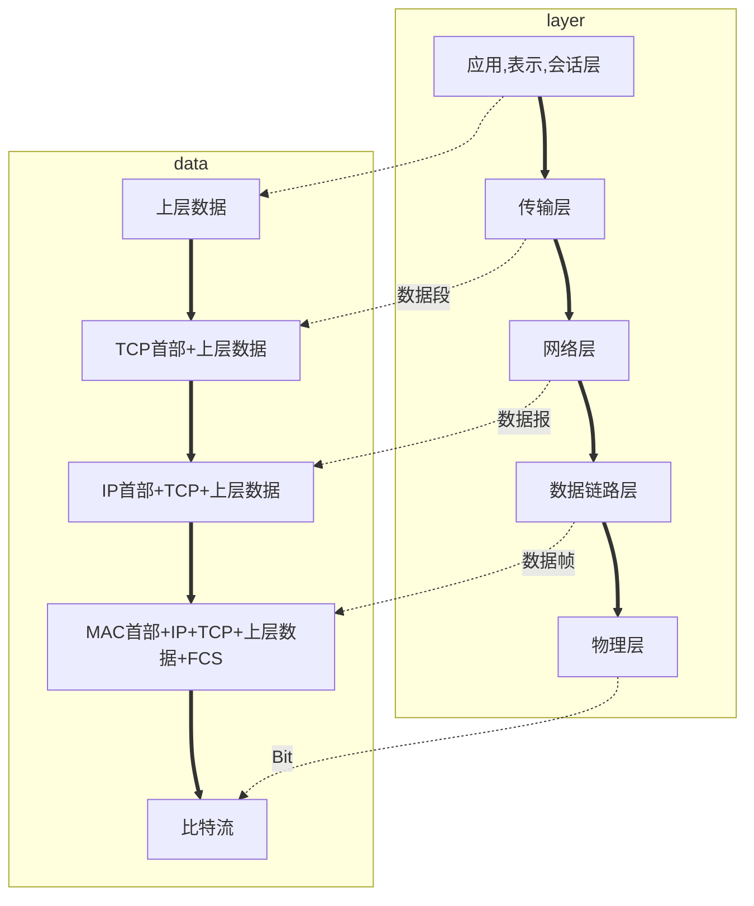

参考书籍: 《TCP/IP详解，卷1：协议》《计算机网络》[视频教程](https://b23.tv/av9876107/p68)

<!-- more -->

# 概述
1. 网络种类
    * 局域网：覆盖范围小，自己花钱购买设备，带宽固定，自己维护
    * 广域网：距离远，花钱租带宽。
    * Internet：ISP，由电信、网通提供服务。
2. 子网掩码：告诉计算机ip地址哪个部分是网络部分，哪个部分是主机部分。
3. 网关：告诉数据报，如果要到其他网段，数据应该传给谁（也可以用于通信协议转化，数据格式转化，充当一个翻译器）。
4. 路由器：负责在不同网段转发数据
5. 地址：
    * ip地址决定了最终目的地
    * mac决定了下一跳去哪儿（48位）
6. 浏览器访问网页步骤：
    * 将域名解析为ip地址（DNS服务器）
    * 整理数据（数据，源ip，目标ip，源mac，目标mac）
    * 路由器根据目标ip地址，选择下一跳去往哪里（路由表）。交换机根据mac地址进行转发，转发过程中，ip地址对交换机是透明的，mac地址会改变。
    * 对网页数据进行切割，放至缓存，逐个分装进行发送。
    * 客户端对数据进行拼凑解析，组合成完整的网页。
7. OSI七层模型
    * 应用层： 所有能产生网络流量的程序。
    * 表示层：在传输之前是否进行加密或压缩处理。
    * 会话层：每个网络连接都会产生一个会话。可使用`netstat -n`进行查看。
    * 传输层：提供可靠或不可靠的传输，提供流量控制功能。
    * 网络层：负责选择最佳路径，规划ip地址。
    * 数据链路层：帧的开始和结束，透明传输，差错校验。
    * 物理层：借口标准，电气标准，如何在物理链路上更快地传输。
8. 网络排错
    * 物理层：查看连接状态，查看收发数据包（水晶头收发数据是分开来的）
    * 数据链路层：MAC地址冲突（可以修改注册表），ADSL欠费，网速无法协商一致，计算机连接到错误的VLAN。
    *  网络层：地址配置错误，没有配置网关，路由器没有到达目标网络的路由。
    *  应用层：应用程序配置错误（错误的代理）

***
	
# TCP/IP协议  
  
<table border="1" cellspacing="0" bordercolor="#000000" width = "80%">
    <tr>
        <td> 应用层 </td>
        <td> HTTP </td>
        <td> FTP </td>
        <td> DNS </td>
    </tr>
    <tr>
            <td> 传输层 </td>
        <th colspan="2"> TCP </th>
        <td> UDP </tD>
    </tr>
    <tr>
            <td> 网络层 </td>
        <th colspan = "3"> IP (ARP, ICMP, IGMP) </th>
    </tr>
    <tr>
            <td> 数据链路层，网络层 </td>
        <td> Ethernet </td>
        <td> ATM </td>
        <td> Frame Relay </td>
    </tr>
</table>


**数据封装**

***

# 物理层
网络设备的机械特性，电气特性，功能特性，过程特性。
数据通行的基础知识：数字信号，模拟信号
充分利用带宽：频分多路复用，时分多路复用

***

# 数据链路层
1. 主要作用是：为ip模块发送以及接受ip模块的数据报，为ARP模块接收请求和返回ARP应答，为RARP模块接收请求和返回RARP应答。封装成帧，透明封装，无差错接收
2. 协议：
    * 点到点线路的数据链路层：PPP（华为二面面试官和我说它早就不用了。。。）
    * 广播信道的数据链路层：CSDA/CD
4.SLIP协议只对报文做了简单的封装，用两个end标志位作起始和结束的标志（压缩版CSLIP）。PPP协议有冗余校验码，两个标志位（7E）
5. 数据链路层有一个最大传输单元，如果IP数据报比它大，则要进行分片。

***

# 网络层

### 设备
1. 路由器：在不同网段转发数据，不负责可靠性服务，负责在不同网络之尽力转发数据包，基于数据包的IP地址转发，不负责丢失重传，不负责顺序。
2. 集线器：这个是物理层设备，加强信号，传递信号。
3. 交换机：这个是数据链路层设备：接收存储比特流，根据目标mac地址决定转发口。
4. 同一网段数据可直接广播ARP，发送到对应主机，否则交给路由器转发。

### IP
1. 首部一半包含IP地址，总长度字段，TTL生存时间，标识字段等。
2. 物理地址是数据链路层和物理层使用的地址，而IP地址是网络层和以上各层使用的地址，是一种逻辑地址（是由软件实现）。
3. 数据在网络上传输时，在网络层只能看到ip数据报，硬件地址（mac地址）不包含在这一层，在路由器上进行转发时，ip数据报首部中的源地址和目标地址始终不变。但是在数据链路层，mac帧首部中的mac地址会随着路由器的转发发生变化。
4. 只要我们在网络层上讨论问题，就能够使用统一的、抽象IP地址研究主机和主机或路由器之间的通信。
  
<table border="1" cellspacing="0" bordercolor="#000000" width = "80%">
    <tr>
        <td> 0 </td> <td> 1 </td> <td> 2 </td> <td> 3 </td> <td> 4 </td> <td> 5 </td> <td> 6 </td> <td> 7 </td>
        <td> 8 </td> <td> 9 </td> <td> 10 </td> <td> 11 </td> <td> 12 </td> <td> 13 </td> <td> 14 </td> <td> 15 </td>
        <td> 16 </td> <td> 17 </td> <td> 18 </td> <td> 19 </td> <td> 20 </td> <td> 21 </td> <td> 22 </td> <td> 23 </td> 
        <td> 24 </td> <td> 25 </td> <td> 26 </td> <td> 27 </td> <td> 28 </td> <td> 29 </td> <td> 30 </td> <td> 31 </td>
    </tr>
    <tr>
        <th colspan="4"> 版本 </th>
        <th colspan="4"> 首部长度 </th>
        <th colspan="8"> 区分服务 </th>
        <th colspan="16"> 总长度 </th>
    </tr>
    <tr>
        <th colspan="16"> 标识 </th>
        <th colspan="3"> 标志 </th>
        <th colspan="13"> 片偏移 </th>
    </tr>
    <tr>
        <th colspan="8"> 生存时间 </th>
        <th colspan="8"> 协议 </th>
        <th colspan="16"> 首部检验和 </th>
    </tr>
    <tr>
        <th colspan="32"> 源地址 </th>
    </tr>
    <tr>
        <th colspan="32"> 目的地址 </th>
    </tr>
    <tr>
        <th colspan="20"> 可选字段（长度可变）</th>
        <th colspan="12"> 填充 </th>
    </tr>
    <tr>
        <th colspan="32"> 数据部分（从传输层得到的数据）</th>
    </tr>
</table>


* 协议：用来标识传输层使用的协议。（在数据链路层有标明网络层协议）
* 区分服务：可以给数据包加上标记，若路由器有配合的服务QOS
* 总长度：最大可以有2^16-1 = 65536字节（在数据链路层：数据最长为1500字节，称为最大传输单元MTU，超过就进行分片(46-1500)）
* 从网络层传入数据链路层的数据，如果数据包的大小不超过1480字节，那么在数据链路层就不需要进行分片。
* 标识：表示该数据包的序号， 这样在数据链路层分片，主机就会对分片的数据重组成完整的数据包 
* 标志：用来表示后面是否有分片，是否允许分片。配合片偏移使用。
* 生存时间：每经过一个路由器减1，防止路由环路。
* 协议字段：指出应将数据部分交给哪一个进程（ICMP: 1; IGMP: 2; TCP: 6; UDP: 17; IPV6: 41; OSPF: 89）
* 首部检验和：反码求和再取反码
* IP协议：选路协议，RIP，OSPF

### ARP和RARP
* 地址解析协议和逆地址解析协议；
    ARP在主机ARP高速缓存中存放一个IP地址到硬件地址的映射表，并且这个映射表还经常动态更新。每个主机上都有一个ARP高速缓存（ARP cache），里面有本局域网上的各主机和路由器的IP地址到硬件地址的映射表。
* 步骤；
    * 在高速缓存中：主机A要想本局域网上主机B发送ip数据报时，先在本机的高速缓存区中查找是否有对应的表项，如果有就读取出来写入mac帧中，再通过局域网将该mac帧发往此硬件地址。
    * 不在：ARP进程会在本局域网内发送广播询问MAC地址，（将IP地址通过广播目标mac地址是FF-FF-FF-FF-FF-FF，解析目标IP地址的MAC地址）然后放入自己的缓存中。
* 位IP协议提供服务。
* ARP欺骗：收到ARP广播之后进行响应，返回自己的MAC地址，比特数据。（同一网段）

### ICMP
测试网络是否有故障
* PING（Packet Internet Grope），因特网包嗅探器 `ping /?`。可用于查看延迟 ，数据包的生存时间(TTL)，估算网络是否畅通
* `pathping`跟踪数据包路径，计算丢包情况
* `tracert` 查看经过的路由器

### 通信方式
> 单播：点到点通信
> 组播（多播）：使用多播IP地址（一组计算机可以接收数据）
> 广播：目标地址为全F，交换机会将数据发送给本局域网内所有主机，但不可跨网段。

### IGMP
用于组播的协议，配置在路由器接口上，路由器会周期性地扫描本网段中哪些主机绑定了多播地址，如果没有主机绑定了多播地址，再决定是否要求上级了路由器发送数据包过来。

***

# 传输层
1. ARP：是从ip地址中解析出mac地址的一种协议。
2. TCP：传输控制协议，需要将要传输的文件分段传输，建立会话，可靠传输，流量控制。
3. UDP：用户数据报协议，一个数据包就能完成数据通信，不分段，不需要建立会话，不需要流量控制，是不可靠的传输服务。（多播广播）
4. 查看会话：`netstat -n`（TCP才会建立会话），查看建立会话的进程：`netstat -nb`，查看服务侦听的端口：`netstat-an`，测试远程计算机某个端口是否打开：`telnet 192.168.80.100 3389`。
5. 服务使用TCP或UDP的端口侦听客户端请求， 客户端使用IP地址定位服务器，使用目标端口定位服务， 可以在服务器网卡上设置只开放必要的端口，实现服务器网络安全。
6. HTTP=TCP+80; HTTPS=TCP+443; RDP=TCP+3389; FTP=TCP+21; SMTP=TCP+25; POP3=TCP+110; telnet=TCP+23; SQL=TCP+1433; DNS=UDP+53; 共享文件夹=TCP+445
7. 传输层为相互通信的**应用进程**提供了逻辑通信。（网络层为**主机之间**提供了逻辑通信。）
8. 端口号只具有本地意义：只是为了标识本计算机应用层中的各进程。
    * 熟知端口：0~1023
    * 登记端口：1024~49151
    * 客户端宽口：数值为49152~65535

### TCP
1. TCP是一种面向有连接的传输层协议。它可以保证两端通信主机之间通信可达，能够处理通信时丢包，乱序等情况，能够有效利用带宽，缓解拥堵。
2. 面向字节流：发送端将某小段字节放入TCP缓存中，进行封装发送给接收端，接收端也会读至缓冲区，再传给上层。
3. TCP连接的端点叫做套接字（socket），端口号拼接到IP地址就构成了套接字。
4. TCP首部，不计任选字段的话：它的首部通常时20字节，前32位（4字节）是源端口号和目标端口号，接下来是报文段的序号（4字节），然后是确认序号（4字节），下面是4位首部长度，6位保留位，6位标志位（URG, ACK, PSH, RST, SYN, FIN）紧跟着（16位）是窗口大小，再接下来是检验和及紧急指针。
  
<table border="3" cellspacing="0" bordercolor="#000000" width = "80%">
    <tr>
        <td> 0 </td> <td> 1 </td> <td> 2 </td> <td> 3 </td> <td> 4 </td> <td> 5 </td> <td> 6 </td> <td> 7 </td>
        <td> 8 </td> <td> 9 </td> <td> 10 </td> <td> 11 </td> <td> 12 </td> <td> 13 </td> <td> 14 </td> <td> 15 </td>
        <td> 16 </td> <td> 17 </td> <td> 18 </td> <td> 19 </td> <td> 20 </td> <td> 21 </td> <td> 22 </td> <td> 23 </td> 
        <td> 24 </td> <td> 25 </td> <td> 26 </td> <td> 27 </td> <td> 28 </td> <td> 29 </td> <td> 30 </td> <td> 31 </td>
    </tr>
    <tr>
        <th colspan="16"> 源端口 </th>
        <th colspan="16"> 目的端口 </th>
    </tr>
    <tr>
        <th colspan="32"> 序号 </th>
    <tr>
        <th colspan="32"> 确认号 </th>
    </tr>
    <tr>
        <th colspan="4"> 数据偏移 </th>
        <th colspan="6"> 保留 </th>
        <th colspan="1"> URG </th>
        <th colspan="1"> ACK </th>
        <th colspan="1"> PSH </th>
        <th colspan="1"> RST </th>
        <th colspan="1"> SYN </th>
		<th colspan="1"> FIN </th>
		<th colspan="16"> 窗口 </th>
    </tr>
    <tr>
        <th colspan="16"> 检验和 </th>
        <th colspan="16"> 紧急指针 </th>
    </tr>
    <tr>
        <th colspan="20"> 可选字段（长度可变）</th>
        <th colspan="12"> 填充 </th>
    </tr>
    <tr>
        <th colspan="32"> 数据部分（从应用层得到的数据）</th>
    </tr>
</table>


	* 确认号：告诉发送放应当发送从多少号开始的数据包。
	* 数据偏移： 用来记录tcp报文段从第多少个字节开始是数据（4*n字节）
	* URG标志：可插队出门; PSH标志：可插队出门; RST标志：异常中断。
	* 窗口：接收缓存窗口，发送缓存窗口。在发起连接时，客户端会告诉服务端它的接收缓存区大小，服务器会把自己的发送缓存窗口设置为同样大小，并且把自己的接收缓存窗口告诉客户端。
	* 检验和：加上伪首部计算
	* 紧急指针：紧急数据结束的位置。
	* MSS（最大数据包长度）；选择性确认。

#### 可靠传输：
* 协议：**停等协议**（超时重传，确认丢失，确认迟到）；**自动重传请求ARQ**（Automatic Repeat reQuest）（在不可靠的传输网络上实现可靠的通信）；**连续ARQ协议**（滑动窗口，累积确认）
* DETAILs:
    * 以字节为单位的滑动窗口技术。在同一时刻，双方的发送窗口和接收窗口并不总是一样。
    * TCP会将应用数据切割成最适合发送的数据块（报文段），再传递给IP层。
	* 如果有丢失，会发送选择性确认->只发送丢失的数据包（收到ACK之后就可以移动窗口）。
    * 发送出去后会有个定时器，超出一定时间后会进行重传。（超时重传时间应略大于加权平均往返时间RTT，`新的RTT = (1 - \alpha) * (旧的RTTs) + \alpha * (新的RTT样本)`）
    * 收到另一端的数据之后，会略微等待后返回确认信息。
    * TCP报文段中有检验和，会检验报文在传输过程中有没有发生变化，如果有差错则不确认这个报文，让另一方进行重发。
    * 传输来的报文如果有失序，会进行重新排序，以正确的顺序交付给应用层。
    * 如果有重复，会丢弃重复数据。
    * 提供流量控制，放置对方的缓冲区溢出。
	* 接收放应有**累计确认**功能，这样可以减小传输开销，捎带确认并不经常发生。
	* **选择确认（Selective ACK）**，在选项字段中，由于首部长度最多只有40字节，选项字段中最多智能指明4个字节块的边界信息。
    

#### 拥塞控制
1. 为了防止过多的数据进入网络中（导致路由器阻塞之类），TCP还提供了流量控制的功能。在TCP报文段首部中，有窗口大小，指的就是当前发送方能够接收数据的缓冲区大小，在发送报文段时，发送方会维护一个**拥塞窗口**，根据网络的拥塞程度动态决定拥塞窗口的大小，然后再进一步控制发送窗口的大小。
2. 它的发送策略是，先使用慢开始算法让拥塞窗口快速增长（指数增长），当拥塞窗口大小达到慢开始门限（阈值）后，拥塞窗口会呈线性增长（每个来回加1），直到出现拥塞情况（拥塞情况就是没有收到确认，虽然不一定是拥塞），出现拥塞后，会把慢开始门限设置位出现拥塞时窗口大小的一半，再重新进行慢开始算法。
3. 除此之外，还有停等协议，回退N帧。拥塞控制的四种算法：慢开始（slow-start）、拥塞避免（congestion avoidance）、快重传（fast retransmit）和快恢复（fast recovery）。
4. **流量控制**往往是指点对点的控制，最主要的让对面来得及处理数据，而**拥塞控制**主要是为了防止过多的数据注入网络，使得链路过载之类。

#### 传输连接管理
也就是三次握手四次挥手，老生常谈，不再赘述。

### UDP
* 特点：无连接，不保证可靠交付，没有拥塞控制，面向报文（适合多媒体通信），支持一对一，一对多，多对一，多对多通信，首部开销小（8字节）。
* 比较简单，首部就只有8个字节，前4个字节是源端口号和目的端口号，后4字节分别是长度和校验和。（面向数据报）它的检验和除了检验它自身的内容之外，还包括一个伪首部，内容包括ip地址等。
  
<table border="1" cellspacing="0" bordercolor="#000000" width = "80%">   
    <tr>
        <td> 0~1 </td> <td> 2~3 </td> <td> 4~5 </td> <td> 6~7 </td>
    </tr>
    <tr>
        <td> 源端口号 </td>
        <td> 目的端口号 </td>
        <td> 长度 </td>
        <td> 检验和 </td>
    </tr>
</table>


* 在计算检验和时，还要加上伪首部，伪首部格式如下
  
<table border="1" cellspacing="0" bordercolor="#000000" width = "80%">   
    <tr>
        <td> 0~3 </td> <td> 4~7 </td> <td> 8 </td> <td> 9 </td> <td> 10~11 </td>
    </tr>
    <tr>
        <td> 源ip地址 </td>
        <td> 目的ip地址</td>
        <td> 0 </td>
        <td> 17 </td>
        <td> UDP长度 </td>
    </tr>
</table>


***

# socket
1. 是网络中进程通信的一种方式，是对TCP/IP协议的一种封装，把接口抽象给用户来进行使用，而不必关心底层的协议实现。
2. 首先和一个端口进行绑定，然后进行侦听，等待客户端进行连接，如果客户端也初始化了一个socket并进行连接，那么连接就建立了。它把建立连接后的这个套接字就当作一个文件来读写。
3. 在网络中确定了*ip地址，端口号，协议*就可以唯一地确定某台主机的某个进程，因此socket只要绑定了对应的端口就可以用底层的协议进行通信了。

# HTTP
1. Http/1.1之前，它是一种无状态，基于请求响应的应用层协议。由于没有状态，所以每次发起请求的时候，都要重新建立TCP连接，通信的时候也是明文传送，十分不安全。
2. 针对无状态问题：可以使用cookies/session；使用长连接。
3. Https: 内容加密，身份验证，数据（完整性）保护。